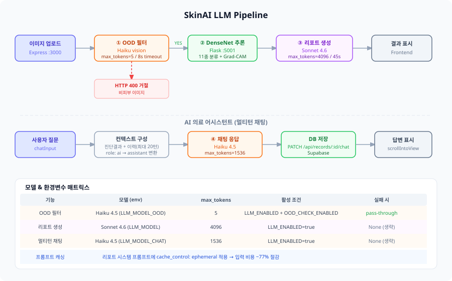

# Part 9. LLM 파이프라인 아키텍처

## 전체 흐름



이미지 업로드 시 LLM이 개입하는 지점은 세 곳이다.

```
업로드
  └─▶ ① OOD 필터      (Haiku vision — 비피부 이미지 거절)
        └─▶ ② DenseNet  (11종 분류 + Grad-CAM)
              └─▶ ③ 리포트 생성   (Sonnet — 구조화 소견)
                    └─▶ ④ 멀티턴 채팅  (Haiku — 후속 질문)
```

---

## ① OOD 필터 (`check_is_skin_image`)

DenseNet은 폐쇄형(closed-world) 분류기라 강아지·음식 사진도 높은 신뢰도로 피부질환으로 오분류한다. 추론 전 Haiku vision이 이진 판별로 차단한다.

**입력 → 처리 → 출력**

```
PIL Image
  └─▶ thumbnail(512×512) + JPEG base64 인코딩
        └─▶ Haiku vision  →  "YES" / "NO"  (max_tokens=5)
              ├─ YES   → DenseNet 추론 진행
              ├─ NO    → HTTP 400  { error: "피부 또는 피부 병변 이미지를 업로드해 주세요.", ood: true }
              └─ None  → pass-through  (API 오류·타임아웃·비활성 시 서비스 중단 방지)
```

**시스템 프롬프트 (5토큰 응답)**
> 이미지가 사람의 피부 또는 피부 병변이면 'YES', 그 외면 'NO'만 출력.

| 항목 | 값 |
|------|-----|
| 모델 | `claude-haiku-4-5-20251001` |
| max_tokens | 5 |
| timeout | 8초 (초과 시 pass-through) |
| 활성 조건 | `LLM_ENABLED=true` + `OOD_CHECK_ENABLED=true` |

---

## ② DenseNet 추론

LLM 관여 없음. Flask `/predict` 엔드포인트에서 수행.

- DenseNet121 / EfficientNet-B3 (체크포인트 설정 따름)
- 11종 분류 → softmax 확률 → top-3 + Grad-CAM 생성
- 신뢰도 < `MIN_CONFIDENCE`(0.35) 또는 클래스별 threshold 미만 → `uncertain: true` 플래그

---

## ③ 리포트 생성 (`generate_report`)

DenseNet 결과를 받아 교육용 한국어 소견을 JSON으로 구조화한다.

**입력 구성**

```
[분류 결과]
- 예측 클래스: {class_name}
- 신뢰도: {confidence}%
- 불확실 플래그: {is_uncertain}
- 상위 3개 후보: ...

[임상 참고 통계]
- 주 발병 연령대: ...
- 주 발병 성별: ...
```

**출력 스키마 (JSON 6필드)**

| 필드 | 내용 | 분량 |
|------|------|------|
| `summary` | AI 분류 결과 요약 | 1~2문장 |
| `mechanism` | 발병 기전 (피부 생리학적 관점) | 2문장 |
| `features` | 임상 특징 (병변 양상·호발 부위) | 2문장 |
| `triggers` | 악화 요인 (기전 중심, 제품명 금지) | 2문장 |
| `learning_point` | 교육적 핵심 포인트 | 1문장 |
| `disclaimer` | 참고용 면책 문구 | 1문장 (20자 이내) |

**필수 원칙**

1. 약품명·처방·치료 프로토콜 언급 금지
2. 모델 예측 외 사실(발병률·가이드라인) 출력 금지
3. 신뢰도 < 70% → "가능성", "관찰됩니다" 등 추정 표현
4. 피부암류 또는 `uncertain=true` → 전문의 대면 진료 강하게 권유

**프롬프트 캐싱**

시스템 프롬프트에 `cache_control: ephemeral` 적용.  
→ 프로세스 재시작 후 첫 호출만 캐시 쓰기, 이후 캐시 읽기로 입력 비용 **약 77% 절감**.

| 항목 | 값 |
|------|-----|
| 모델 | `claude-sonnet-4-6` |
| max_tokens | 4096 |
| timeout | 45초 |
| 활성 조건 | `LLM_ENABLED=true` |
| 실패 시 | `None` 반환 (소견 섹션 생략) |

**JSON 파싱 안전장치 (`_extract_json_object`)**

Claude가 코드블록(` ```json `)이나 프리픽스를 붙이는 경우에 대비해 첫 `{`·마지막 `}` 사이만 추출 후 `json.loads`.  
`JSONDecodeError` 시 사용자 친화 오류 메시지를 담은 폴백 dict 반환.

---

## ④ 멀티턴 채팅 (`chat_response`)

분석 결과를 컨텍스트로 보유한 채 후속 질문에 답변한다.

**대화 이력 관리**

```
DB role  →  Claude API role
"user"   →  "user"
"ai"     →  "assistant"

최대 전달 턴: CHAT_HISTORY_MAX × 2 = 40 메시지
초과분은 오래된 것부터 제거
```

**첫 메시지 vs 후속 메시지**

```
첫 메시지  = [분석 결과] 질환·신뢰도·소견 요약 + [질문]
후속 메시지 = 질문만 전달 (컨텍스트는 이력에 이미 포함)
```

**시스템 프롬프트 핵심 지침**

- 교육·학습 목적 사용자 전제 → 개인 건강 전제 표현 금지
- 서두 문구 금지 ("~에 대해 설명하겠습니다" 류)
- 마크다운 기호 금지 (`#`, `**`, `-` 등)
- 후속 질문 유도 문구 — 매 답변마다 붙이지 않고 흐름상 필요할 때만

| 항목 | 값 |
|------|-----|
| 모델 | `claude-haiku-4-5-20251001` |
| max_tokens | 1536 |
| 활성 조건 | `LLM_ENABLED=true` |
| 실패 시 | `None` → 프론트에서 "LLM 비활성" 표시 |

---

## 환경변수 전체 목록

| 변수 | 기본값 | 설명 |
|------|--------|------|
| `LLM_ENABLED` | `false` | 전체 LLM ON/OFF (false 시 모든 LLM 기능 비활성) |
| `ANTHROPIC_API_KEY` | — | Anthropic API 키 |
| `LLM_MODEL` | `claude-sonnet-4-6` | 리포트 생성 모델 |
| `LLM_MODEL_CHAT` | `claude-haiku-4-5-20251001` | 채팅 모델 |
| `LLM_MODEL_OOD` | `claude-haiku-4-5-20251001` | OOD 필터 모델 |
| `LLM_MAX_TOKENS` | `4096` | 리포트 최대 토큰 |
| `LLM_MAX_TOKENS_CHAT` | `1536` | 채팅 최대 토큰 |
| `OOD_CHECK_ENABLED` | `false` | OOD 필터 단독 ON/OFF |
| `OOD_IMAGE_MAX_DIM` | `512` | Haiku 전송 전 리사이즈 최대 픽셀 |
| `OOD_TIMEOUT_SEC` | `8` | OOD 판별 타임아웃 (초과 시 pass-through) |

**활성 조합 매트릭스**

| `LLM_ENABLED` | `OOD_CHECK_ENABLED` | OOD 필터 | 리포트 | 채팅 |
|:---:|:---:|:---:|:---:|:---:|
| false | — | ✗ | ✗ | ✗ |
| true | false | ✗ | ✓ | ✓ |
| true | true | ✓ | ✓ | ✓ ← 권장 |

---

## 비용 추정 (₩1,492/$ 기준, 2026.05)

| 기능 | 모델 | 입력단가 | 출력단가 | 요청당 비용 |
|------|------|---------|---------|-----------|
| OOD 필터 | Haiku 4.5 | ₩1,492/MTok | ₩7,460/MTok | ≈ ₩1 |
| 리포트 생성 | Sonnet 4.6 | ₩4,476/MTok (캐시 ₩448) | ₩22,380/MTok | ≈ ₩12 |
| 채팅 메시지 | Haiku 4.5 | ₩1,492/MTok | ₩7,460/MTok | ≈ ₩3 |

| 일 사용자 | 월 합계 |
|-----------|--------|
| 50명 | ≈ ₩22,000 |
| 300명 | ≈ ₩137,000 |
| 1,000명 | ≈ ₩458,000 |

---

## 에러 처리 요약

| 상황 | 동작 |
|------|------|
| `LLM_ENABLED=false` | 클라이언트 싱글턴이 `None` → 모든 함수 즉시 `None` 반환 |
| `ANTHROPIC_API_KEY` 미설정 | 클라이언트 생성 실패 → 경고 로그 + `None` |
| OOD API 타임아웃 (> 8초) | `pass-through` → DenseNet 분류 진행 |
| OOD `APIError` | `pass-through` → DenseNet 분류 진행 |
| 리포트 `JSONDecodeError` | 폴백 dict (사용자 오류 메시지) 반환 |
| 리포트 `APIError` | `None` 반환 → 소견 섹션 숨김 |
| 채팅 `APIError` | `None` 반환 → 프론트 "LLM 비활성" 표시 |
